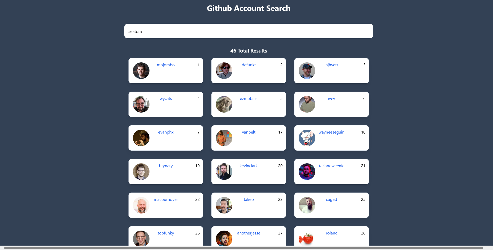
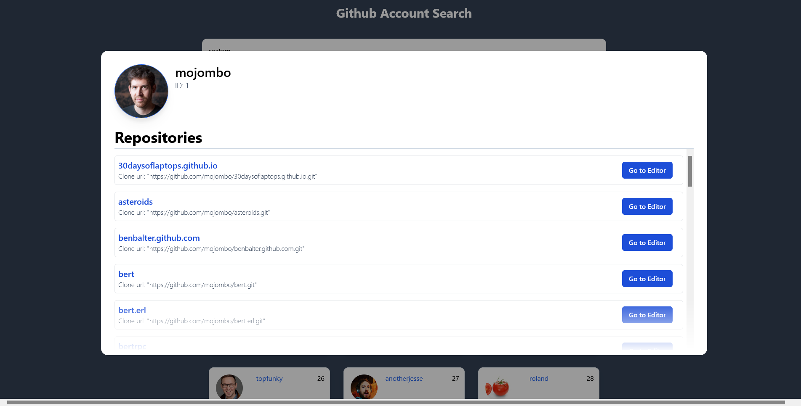

# Github Account Search

This was a quick project I made to help me get use to svelte. This is an app that uses the github api to search for a user and once you click on their card a details section will appear with a list of their public repositories. With that list you can: 
- go to their repo
- copy the clone link
- open it in the github vscode editor

